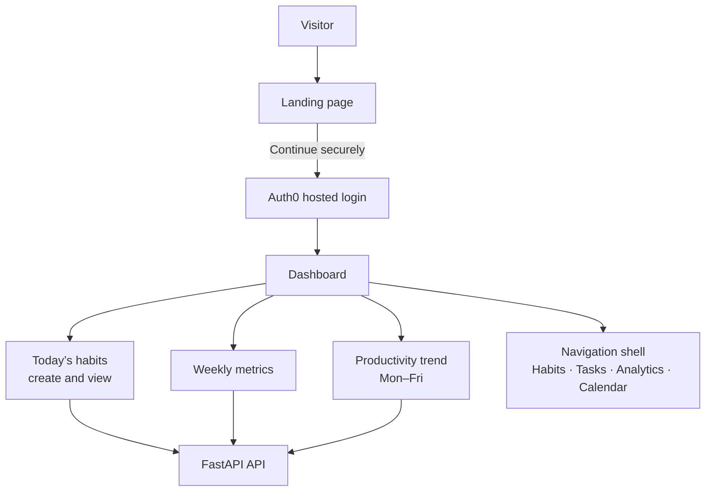
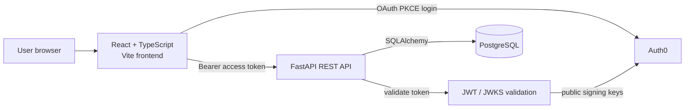
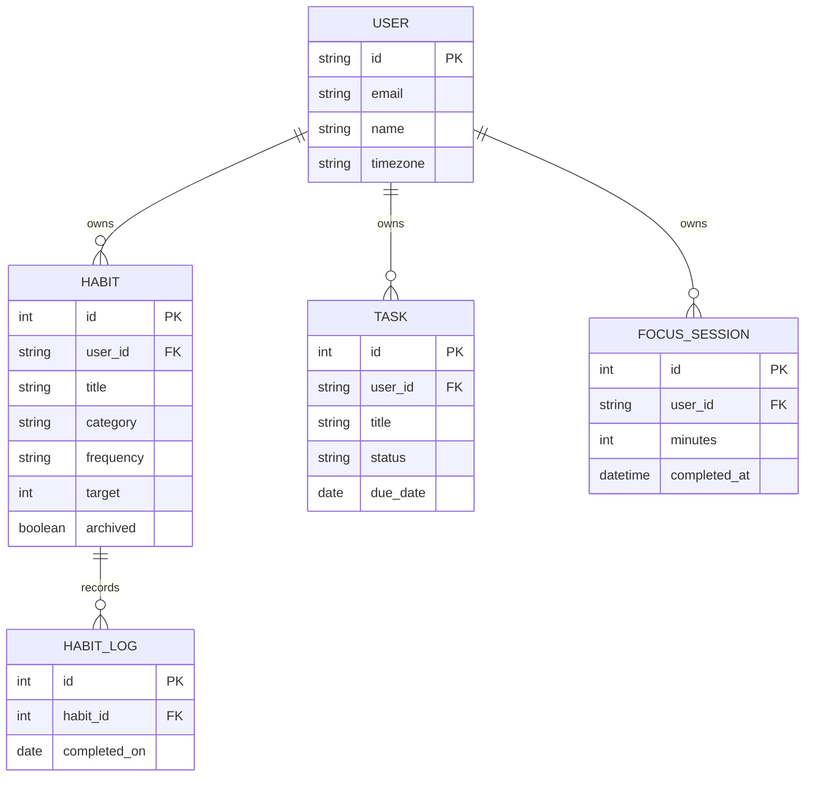

# HabitFlow

HabitFlow is a full-stack habit and productivity dashboard. It lets an authenticated user create habits, record daily completions, add tasks, log focused-work sessions, and see analytics based on those saved records.

## What is included

- Auth0 sign-in with a hosted login page and bearer-token API access.
- User-owned habits, tasks, focus sessions, and a protected profile endpoint.
- One habit completion per habit and calendar day, enforced by a database unique constraint.
- A current-workweek productivity chart sourced entirely from the API.
- A React + TypeScript frontend and FastAPI + SQLAlchemy backend, backed by PostgreSQL.

## Website map



The navigation labels provide the intended dashboard structure. In this release, the Overview dashboard and its habit/analytics API flows are implemented; dedicated Tasks, Analytics, and Calendar screens are not yet built.

## Architecture



### Frontend

`frontend/src/main.tsx` contains the single-page dashboard. Auth0 provides identity; TanStack Query manages authenticated reads and mutation refreshes; Axios communicates with `/api`; and Recharts renders the trend series. Styling is plain CSS in `frontend/src/styles.css`—there is no Tailwind build step.

### Backend

`backend/app/main.py` creates the FastAPI application and mounts the `/api` router. `backend/app/auth/jwt.py` validates Auth0 access tokens. The router performs input validation, checks ownership before changing resources, and queries SQLAlchemy models defined in `backend/app/models/core.py`.

### Data model



## How the productivity trend works

The chart is not demo or placeholder data. The `/api/analytics/weekly` endpoint generates one point for each weekday in the current Monday–Friday workweek. For each date, it counts that user’s saved habit completions and sums that user’s saved focus minutes:

`daily productivity score = min(100, habit completions × 10 + focus minutes ÷ 10)`

Days with no saved activity correctly render as `0`. The dashboard’s **Weekly score** is the rounded average of those five daily scores. The API returns the date, weekday label, and calculated score for every bar, and the UI displays that returned array directly.

## API routes

| Route | Purpose |
| --- | --- |
| `GET/POST /api/habits` | List or create the current user’s habits |
| `PUT/DELETE /api/habits/{id}` | Update or archive a habit the user owns |
| `POST/DELETE /api/habits/{id}/complete` | Record or undo today’s completion |
| `GET/POST /api/tasks` | List or create tasks |
| `PUT/DELETE /api/tasks/{id}` | Update or delete a task |
| `POST /api/focus-sessions` | Record a focus session |
| `GET /api/analytics/weekly` | Return current-workweek totals and daily trend data |
| `GET /api/profile` | Return the authenticated user |

Open `http://localhost:8000/docs` while the API is running for generated interactive documentation.

## Run locally

1. Copy `.env.example` to `backend/.env` and fill in the Auth0 values.
2. Create a PostgreSQL database and set `DATABASE_URL`.
3. Start the backend:

   ```bash
   cd backend
   python -m venv .venv
   .venv/bin/pip install -r requirements.txt
   uvicorn app.main:app --reload
   ```

4. Start the frontend in another terminal:

   ```bash
   cd frontend
   npm install
   npm run dev
   ```

Create an Auth0 SPA and API, enable the desired social connections, and configure the `VITE_AUTH_*` values for the SPA plus `AUTH_*` values for the API. Do not commit `.env` files.

## Deployment

Deploy `frontend/` to Vercel (or another static host), `backend/` to Render/Railway/a container platform, and provision PostgreSQL through the selected provider. Set the frontend API/Auth0 values and backend database/Auth0 values in the hosting environments. Before release, restrict CORS to the deployed frontend origin.

## Deliberately not included

There is no AI integration, OpenAI key, Alembic migration setup, or Tailwind/PostCSS pipeline in this project. Those dependencies and configuration have been removed so the repository represents the implemented application only.

## Suggested next steps

Add automated tests, Alembic migrations when schema versioning is needed, dedicated task/calendar/analytics screens, timezone-aware aggregation, rate limiting, and production observability.
